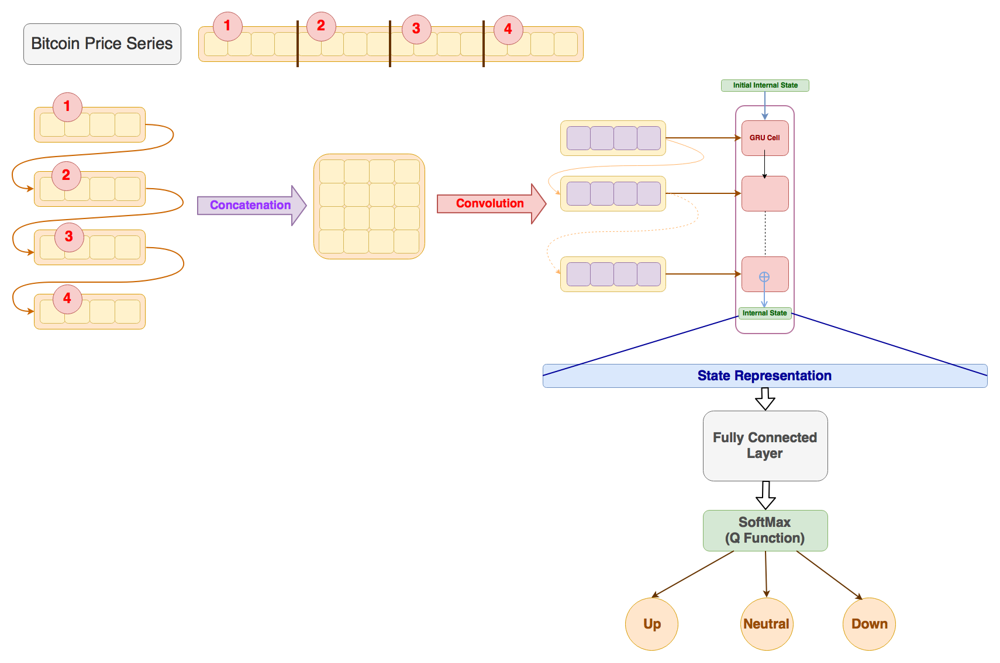

# Deep Trading Agent

[](https://github.com/samre12/deep-trading-agent/blob/master/LICENSE)
[](https://www.tensorflow.org/)
[](https://www.python.org/download/releases/2.7/)
[](https://github.com/samre12/deep-trading-agent/)
[](https://github.com/samre12/deep-trading-agent/)
[](https://cloud.docker.com/app/samre12/repository/docker/samre12/deep-trading-agent/builds)
<br>
Deep Reinforcement Learning based Trading Agent for Bitcoin using [DeepSense](https://arxiv.org/abs/1611.01942) Network for Q function approximation. <br><br>

<br>
For complete details of the dataset, preprocessing, network architecture and implementation, refer to the [Wiki](https://github.com/samre12/deep-trading-agent/wiki) of this repository.

## Requirements

- Python 2.7
- [Tensorflow](https://www.tensorflow.org/)
- [Pandas](https://pandas.pydata.org) (for pre-processing Bitcoin Price Series)
- [tqdm](https://pypi.python.org/pypi/tqdm) (for displaying progress of training)<br>

To setup a ubuntu virtual machine with all the dependencies to run the code, refer to [`assets/vm`](https://github.com/samre12/deep-trading-agent/tree/master/assets/vm).

## Run with Docker

Pull the prebuilt docker image directly from docker hub and run it as

```bash
docker pull samre12/deep-trading-agent:latest
docker run -p 6006:6006 -it samre12/deep-trading-agent:latest
```

**OR**<br>

Build the docker image locally by executing the command and the run the image as

```bash
docker build -t deep-trading-agent .
docker run -p 6006:6006 -it deep-trading-agent
```

This will setup the repository for training the agent and

- mount the current directory into `/deep-trading-agent` in the container

- during image build, the latest transactions history from the exchange is pulled and sampled to create per-minute scale dataset of Bitcoin prices. This dataset is placed at `/deep-trading-agent/data/btc.csv`

- to initiate training of the agent, specify suitable parameters in a config file (an example config file is provided at `/deep-trading-agent/code/config/config.cfg`) and run the code using `/deep-trading-agent/code/main.py`

- training supports logging and monitoring through *Tensorboard*

- `vim` and `screen` are installed in the container to edit the configuration files and run `tensorboard`

- bind port *6006* of container to *6006* of host machine to monitor training using *Tensorboard*

## Support

Please give a :star: to this repository to support the project :smile:.

## ToDo

### Docker Support

- [X] Add Docker support for a fast and easy start with the project

### Improve Model performance

- [X] Extract highest and lowest prices and the volume of Bitcoin traded within a given time interval in the [`Preprocessor`](https://github.com/samre12/deep-trading-agent/blob/f8b5604aac3e68905034e4a0597867f37cecb342/code/process/processor.py#L9)
- [X] Use closing, highest, lowest prices and the volume traded as input channels to the model (remove features calculated just using closing prices)
- [X] Normalize the price tensors using the price of the previous time step
- [X] For the complete state representation, input the remaining number of trades to the model
- [X] Use separate diff price blocks to calculate the unrealized PnL
- [ ] Use [exponentially decayed weighted unrealized PnL](https://github.com/samre12/deep-trading-agent/wiki/Reward-Function#exponentially-weighted-unrealized-pnl) as a reward function to incorporate current state of investment and stabilize the learning of the agent

## Trading Model

is inspired by [Deep Q-Trading](http://cslt.riit.tsinghua.edu.cn/mediawiki/images/5/5f/Dtq.pdf) where they solve a simplified trading problem for a single asset.
<br>
For each trading unit, only one of the three actions: neutral(1), long(2) and short(3) are allowed and a reward is obtained depending upon the current position of agent. Deep Q-Learning agent is trained to maximize the total accumulated rewards. <br>
Current Deep Q-Trading model is modified by using the *Deep Sense* architecture for *Q function* approximation.

## Dataset

Per minute Bitcoin series is obtained by modifying the procedure mentioned in [this](https://github.com/philipperemy/deep-learning-bitcoin) repository. Transactions in the *Coinbase* exchange are sampled to generate the Bitcoin price series. <br>
Refer to [`assets/dataset`](https://github.com/samre12/deep-trading-agent/tree/master/assets/dataset) to download the dataset.

### Preprocessing

**Basic Preprocessing**<br>
Completely ignore missing values and remove them from the dataset and accumulate blocks of continuous values using the timestamps of the prices.<br>
All the accumulated blocks with number of timestamps lesser than the combined *history length* of the state and *horizon* of the agent are then filtered out since they cannot be used for training of the agent.<br>
In the current implementation, past 3 hours (180 minutes) of per minute Bitcoin prices are used to generate the representation of the current state of the agent.<br>
With the existing dataset (at the time of writing), following are the logs generated while preprocessing the dataset:
```
INFO:root:Number of blocks of continuous prices found are 58863
INFO:root:Number of usable blocks obtained from the dataset are 887
INFO:root:Number of distinct episodes for the current configuration are 558471
```

**Advanced Preprocessing**<br>
Process missing values and concatenate smaller blocks to increase the sizes of continuous price blocks.<br>
Standard technique in literature to fill the missing values in a way that does not much affect the performance of the model is using exponential filling with no decay.<br>
*(To be implemented)*

## Implementation

Tensorflow "1.1.0" version is used for the implementation of the **Deep Sense** network.<br>

### Deep Sense

Implementation is adapted from [this](https://github.com/yscacaca/DeepSense) Github repository with a few simplifications in the network architecture to incorporate learning over a single time series of the Bitcoin data.

### Deep Q Trading

Implementation and preprocessing is inspired from this [Medium post](https://hackernoon.com/the-self-learning-quant-d3329fcc9915). The actual implementation of the Deep Q Network is adapted from [DQN-tensorflow](https://github.com/devsisters/DQN-tensorflow).
